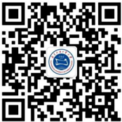
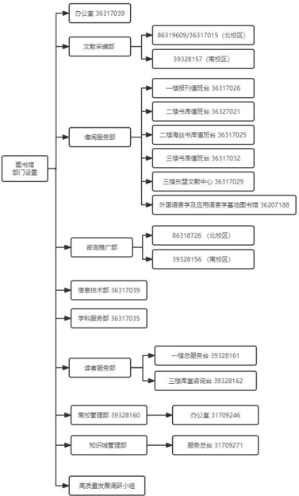
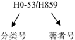
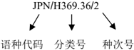
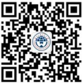

## 读者手册

广东外语外贸大学图书馆 二〇二四年六月

广外图书馆主页

广外图书馆

微信

悦读广外

微信

## 目录

| 读者文明公约 ................................................................................................2   |                                                                                          |
|------------------------------------------------------------------------------------------------------------|------------------------------------------------------------------------------------------|
| 第一编：概况 ................................................................................................3   |                                                                                          |
| 一、历史、现状与办馆理念                                                                                               | ................................................................3                        |
| 二、丰富的馆藏                                                                                                    | ....................................................................................4    |
| 三、至诚的服务                                                                                                    | ....................................................................................7    |
| 四、开放性的交流平台                                                                                                 | ......................................................................13                 |
| 五、部门设置                                                                                                     | ......................................................................................16 |
| 第二编：图书馆读者管理制度                                                                                              | ..................................................................18                     |
| 一、 读者入馆守则                                                                                                  | ............................................................................18           |
| 二、借阅证办理与使用                                                                                                 | ......................................................................21                 |
| 三、馆藏文献下载及复制规定                                                                                              | ..........................................................26                             |
| 四、读者违章处理办法                                                                                                 | ......................................................................27                 |
| 第三编：图书馆使用指南                                                                                                | ..........................................................................33             |
| 一、馆藏文献布局                                                                                                   | ..............................................................................33         |
| 二、开放时间                                                                                                     | ......................................................................................35 |
| 三、书刊排架方式                                                                                                   | ..............................................................................37         |
| 四、馆藏文献检索系统说明                                                                                               | ..............................................................39                         |
| 五、图书自助借还机使用说明                                                                                              | ..........................................................40                             |
| 六、 24 小时图书自助还书机使用说明                                                                                        | .............................................41                                          |
| 七、 IC 空间使用说明                                                                                               | .........................................................................41              |
| 八、中文论文查重检测服务                                                                                               | ..............................................................44                         |
| 九、借阅光盘服务                                                                                                   | ..............................................................................47         |
| 十、自助文印系统的使用说明                                                                                              | ..........................................................48                             |
| 附件 1 ：图书馆服务清单                                                                                              | ...........................................................................50            |

## 读者文明公约

衣着得体，不穿背心、拖鞋入馆。

讲究卫生，不随地吐痰、不在馆内吃食物、不乱扔垃圾。

举止文明，不在馆内争吵打闹、做有碍观瞻之举。

保持安静，不在馆内朗读、喧哗、大声使用通讯工具。

遵守秩序，不在馆内霸位。

爱护公物，不污损设施设备、毁坏文献资料。

遵章守纪，不侵害他人合法权益、自觉维护馆内秩序。

## 第一编：概况

## 一、历史、现状与办馆理念

广东外语外贸大学图书馆始建于 1965 年，前身为广州 外国语学院图书馆（始建于 1965 年） ， 1995 年 6 月与原广 州对外贸易学院图书馆（始建于 1980 年）合并， 2008 年 10 月，原广东财经职业学院图书馆划转并入。

广东外语外贸大学图书馆现有布局为： 一体两翼三区四 馆。一体是指图书馆管理、资源、业务和服务一体化；两翼 是指： 纸质资源和数字资源并举、 传统业务和新兴服务并重； 三区四馆是指图书馆在大学三个校区有四个馆舍， 其中白云 山校区图书馆位于白云山北麓，面积 2 . 3 万平方米；大学城 校区图书馆位于番禺广州大学城，面积 2 . 8 万平方米；知识 城校区图书馆位于中新广州知识城校区， 过渡期图书馆位于 进德楼 B1 栋一、二楼，面积约 1700 平方米。此外白云山 校区还设有外国语言学及应用语言学基地图书室。

图书馆总面积 5 .42 万平方米，实行藏、借、阅、研一 体化的开放式管理模式，提供阅览座位 5778 个，信息节点 2700 个；拥有 2 个多功能报告厅和多间小型会议室、读者 个人研修室。

图书馆下设文献采编部、借阅服务部、学科服务部、咨 询推广部、信息技术部、读者服务部、办公室、大学城校区

图书馆管理部（内设） 、知识城图书馆管理部（内设）共有 工作人员89人。拥有中级专业技术职称41人，高级职称 14 人。

图书馆是 CALIS （中国高等教育文献保障系统） 、 CASHL （中国高校人文社会科学文献中心） 、全国外语院校 图书馆联盟、全国财经院校图书馆联盟、粤港澳高校图书馆 联盟等资源共享和服务协作机构的成员单位， 与北大、 清华、 武大、厦大、中大以及国家图书馆、上海图书馆等国内著名 图书馆有稳定的馆际合作关系。

我馆秉持'博爱 公允 至诚 服务'的馆训，紧紧围绕 学校中心工作，以'资源宝库·文化平台·读者家园'三位 一体为价值定位，全体员工同心同德、开拓进取，适应新形 势，迎接新挑战，抢抓新机遇，力促新发展，在图书馆资源 建设与平台建设、基础服务与创新服务、形象定位与功能拓 展等方面，取得了显著进步，为全校教学科研、人才培养提 供细致、周到、可靠、安全的全方位文献信息资源服务与保障。

## 二、丰富的馆藏

## 纸本资源

截止2023 年底，图书馆馆藏纸质书刊302.98万册，文 献语种达 35 种。中外文纸质报刊1204种， 1389 份，丰富 的外文图书和期刊， 是我馆作为涉外型图书馆的突出的馆藏 特色。

## 电子资源

截止2023年底， 图书馆拥有中外文电子书 378.77 万册， 中外文电子期刊278.92万册，中外文电子数据库131个， 自建数据库 7 个。自建数据库包括：馆藏书目检索、本校教 师著述全文数据库、广外硕博士学位论文数据库、广外学术 典藏库、加拿大研究库、台风气旋专题特色库、外文数据库 和外国文学文化研究数字化图书。

图书馆根据学校学科布局和科研教学需求，订购了 CNKI 中国知网系列数据库、读秀知识库、万方学位论文库、 CSMAR 中国经济金融研究数据库、国务院发展研究中心信息 网、Taylor &amp; Francis SSH 期刊数据库、 Web of Science SSCI 及A&amp;HCI、CUP 剑桥期刊数据库、OUP 牛津期刊数据库、 Wiley-Blackwell 期刊数据库、Elsevier ScienceDirect 期 刊数据库、Proquest 系列数据库、Emerald 管理学全集数据 库、HeinOnline 法学期刊全文数据库等数字资源、Lexis 法 律信息库，并提供国内一流的数字资源校外访问系统，满足 读者的校外访问需求。

## 特色馆藏

【外国语言学及应用语言学基地图书室】 收录国内最 为丰富的语言学与应用语言学方面的图书和核心刊物， 供室 内阅览 。

【商科英语资源中心】 集中收录及展示了英文原版经 济、商业、管理方面的经典及最新图书及核心期刊，相关专 业数据库等。

【广外-羊晚新闻传播图书资料中心】该中心成立于 2015 年 6 月，其中的书架和图书全由'羊城晚报集团'捐

赠，该特藏馆书籍位于大学城校区图书馆六楼，目前文献资 源总量接近 10 万册，藏有普通图书、工具书、年鉴、画册 等纸质文献。

【广外文库】 广外文库于 2015 年 10 月在原教师著作 室的基础上筹建而成，主要收藏广外人（ 现任教职员工和历 届校友 ）的个人学术著作，广外主办的学术期刊、校报及其 他内部出版刊物，以及有关广外人、广外事等方面的文献， 是一个较全面展示我校建校以来全体师生、 校友的科研成果 及广外人文风采的特色馆藏。截至目前，共收藏广外人的著 作 2694 种， 3349 册书刊，以文学、语言、经贸、法律等为主。

【桂诗春图书室】坐落于白云山校区第八教学楼三楼， 桂诗春图书室收录了桂诗春教授个人著作、个人藏书、学术 光盘及数字资料（ 硬盘 ）等。

【精品图书室】 坐落于图书馆四楼东侧，收藏了清初 清末古籍若干、华洋贸易总汇、四库全书、传世藏书、二十 四史、四编清代稿钞本、葡萄牙驻广州总领事档案、大英百 科全书等珍贵出版物。

【 21 世纪海上丝绸之路协同创新中心资源共享平台】 此平台为以我校为牵头单位的广东省国家级' 21 世纪海上 丝绸之路协同创新中心'提供文献资源保障，重点收藏海上 丝绸之路沿线国家的有关政治、社会文化、历史地理等方面 研究的文献资料。本室藏书约 14345 册，为我校广东国际战 略研究院及研究广东与港澳东南亚区域相关专题的教师、 研 究生提供相对充实的特色文献资料保障。

【东盟文献中心】东盟文献中心收藏有越南语、泰语、 印尼语、马来语、缅甸语、老挝语、柬埔寨等9种东盟语种 的图书共计40598册（ 截至2023 年 12 月 ） 。

【英语资料中心图书室】 含英国领事馆捐赠图书资料

以及部分 Gale Research Co 出版系列原版图书等。

## 三、至诚的服务

图书馆服务时间为 8 : 30 -22 ： 00 时间为 7 : 00 -24 : 00 （ 知识城暂为6:30-22:00

达 119 小时。

## 流通服务

图书馆提供图书借还、续借、预约和架上预约等常规性

服务。此外还提供以下特色服务：

【帮您找书】 为更好的满足读者需求，图书馆推出的 '帮您找书'服务，已实现白云山校区、大学城校区和知识 城多校区图书的通借通还、密集书库图书的借阅、显示在架 但没有找到图书的借阅， 以及对已外借的图书进行预约等功 能。每位读者每周最多可以提交 15 个找书请求。归还时， 只需在所在校区图书馆的自助还书机或总服务台归还图书

即可。

## 服务链接：

http :// libsvc . gdufs . edu . cn : 9071 / findbook / register /? ba

，其中公共阅览区服务 ） ， 每周开放时间

rcode = A2360896 &amp; isloan =% E5 % 9C % A8 % E6 % 9E % B6 % E4 % B8 % 8A

【 24 小时自助还书】 除正常人工服务外，白云山、大 学城两校区图书馆同时设置 24 小时自助还书机，读者不必 入馆即可自助还书。

【图书荐购】 登陆数字广外或图书馆主页荐购系统， 可向图书馆荐购所需图书。读者如有急需用书，可申请'绿 色通道'服务进行采购。

服务链接：图书馆主页-常用服务-图书荐购

https

:// lib . gdufs . edu . cn / fwzn / tsjg / jgxt . htm

## 咨询服务

图书馆致力于为读者提供全方位、多元化的咨询服务， 协助读者更高效、更快捷使用图书馆资源。开展了学位论文 网上提交、在线参考咨询、网上视听服务等基于网络平台的 信息服务项目。此外，还提供以下特色服务：

【专题检索服务】 为我校教师的科研教学项目提供专题 信息资源的检索服务，也可代查本校教师的论文被 SCI 、

SSCI 等引文索引收录及被引用情况。

服务链接：图书馆主页-服务指南

https :// lib . gdufs . edu . cn / fwzn / cscyfw . htm

【文献传递服务】 通过文献传递服务，获取我馆目前 没有的文献资源， 实现资源共享。 服务内容包括为读者借入、 复印和提供本馆未收藏的图书、期刊论文、学位论文、会议 文献等。传递方式包括 E -mail 、普通邮寄、特快专递或者

自取等。

服务链接：图书馆主页-服务指南-文献传递

https :// lib . gdufs . edu . cn / fwzn / wxcd . htm

【信息素养教育】 帮助读者培养图书馆意识，掌握检 索和利用信息资源的技能。有新生入馆教育、图书馆资源与

服务利用专题讲座、数据库讲座等。

【学科服务】 通过图书馆学科联系馆员深入到学院和 科研机构的教学活动或科研中， 帮助教师和科研人员发现和 提供更多的专业资源和信息导航， 为他们的研究和工作提供 针对性更强的信息服务， 是图书馆创新精神和个性化服务特

征的具体体现。

服务链接：图书馆主页-服务指南-学科服务

https :// lib . gdufs . edu . cn / info / 1049 / 5224 . htm

【论文查重】 图书馆订购了中国知网学术不端文献检 测系统，面向本校教职工提供论文检测、查重服务。

服务链接：图书馆主页-服务指南-论文查重检测系统

https :// lib . gdufs . edu . cn / fwzn / lwczjcfw / zgzwCNKIxs bdjcxt . htm

## 技术服务

【 OPAC 检索系统】 检索图书和期刊目录，凭个人学 工号登陆可查询个人借阅情况、进行网上预约、续借等。登

录网址： http :// opac . gdufs . edu . cn : 8991 / F

【云山搜索】 提供图书馆馆藏纸质和数字资源的一站 式资源检索和发现服务。登录网址：

http :// discovery . gdufs . edu . cn : 1701

【通知提醒服务】 读者在'读者登记'页面中登记手 机号码和邮箱后，即可收到来自图书馆的超期、催还、图书 预约等通知服务。

通过关注广外图书馆微信公众号，菜单栏'查阅-我的 借阅'中绑定个人账号后，即可收到来自图书馆的借还书、 空间预约、催还、超期、欠款等通知服务。

通知服务的内容仅供参考，请以'我的图书馆'中显示 的信息为准。

【超星移动图书馆】 超星移动图书馆是拥有超过百万 册电子图书，海量报纸文章以及中外文献元数据，为图书馆 用户提供方便快捷的移动阅读服务。

【数字资源校外访问服务】 为广大读者校外使用图书 馆 馆 购 数 字 资 源 提 供 途 径 。 登 录 网 址 ： http :// 202 . 116 . 197 . 75 /或者 librra . gdufs . edu . cn

【微信公众号】 图书馆开设有服务号'广外图书馆' 由咨询推广部负责运营管理。可手机实现资源检索、借阅查 询、预约委托借阅三校区图书、校外访问、自助文印、空间 预约、座位管理、人脸注册、读者登记、活动公告等各项服 务，读者通过公众号绑定个人学号后，还可收到书的借还、 催还信息推送等。订阅号'悦读广外' ，由紫云读书社负责 日常更新，借此了解图书馆各类讲座、沙龙、英语角、观影

会、读书会、专题小书架、活动预告的通知。

【悦读微信群】开设'广外悦读【教师】 ' 、 '广外悦读 【白云山学生】 ' 、 '广外悦读【大学城学生】 ' 、 '广外图书馆 -知图悦读'四大微信群， 24 小时在线解答读者疑问。

【微信座位系统（ 试用 ） 】 通过'广外图书馆'微信公 众号，使用微信座位系统（ 试用 ） ，可实现图书馆座位现场 预约和在线预约。解决图书馆占座问题，提高图书馆阅览座

位的使用效率。

## 多媒体服务

【图书馆多媒体阅览室】 提供光盘、磁带、 VCD 等 声像资料视听及在线下载， 也可检索图书馆提供的电子数据 库，上网浏览资讯。

## 信息共享（ IC ）空间服务

【信息共享 IC 空间】 信息共享空间是以读者为中心， 为满足全体教职工和研究生读者对协同式学习、 科研环境的 需求而建设的一种图书馆新型服务模式。 整合的资源除了图 书文献数据之外、 还包含了可供学习和科研使用的各类软硬 件设备，以及各种格局不一的开放或封闭的物理空间。在线 预约系统： http :// lib . gdufs . edu . cn : 88 /

## 紫云读书社

紫云读书社是图书馆指导并在学校注册备案的学生社

团，坚持'博爱 公允 至诚 服务'的馆训，协助图书馆做 好读者管理、阅读推广和志愿者工作。紫云读书社由五个部 门组成， 分别是实践部、 人力资源部 （大学城 校区为志愿部 ） 、 新闻部、设计部和秘书部，各部门分工明确，共同协助图书 馆工作人员参与图书馆服务与管理， 并定期开展阅读推广活 动。紫云读书社社员和志愿者招募时间分春季和秋季两次， 采取线上和线下相结合的方式进行报名， 热诚欢迎各位同学 加入。 （ 报名时间和报名方式等详细信息请留意'广外图书 馆'和'悦读广外'微信公众号 ）

## 参观预约

图书馆面向团体和个人提供参观导览服务。

如需参观讲解，请在'智慧广外-线上办事大厅-图书馆 -图书馆服务事项'中按要求填写相应信息，经所在单位领 导及图书馆咨询推广部审批后，将有专人负责联系落实。经 所在单位领导及图书馆咨询推广部审批后， 将有专人负责联 系落实。

咨询电话：

020 - 86318726

参考网址：

https

:// lib . gdufs . edu . cn / zxtg / cgyy . htm

## 培训预约

为更好地满足全校师生在教学、 科研和学习的过程中检 索、查找与利用图书馆信息资源的个性化需求，图书馆为大 家提供免费的培训讲座预约服务。培训内容包括但不限于： 嵌入专业课程的信息素养培训、 数据库专题讲座及其他图书

馆服务和资源使用培训。

读者也可将在使用图书馆信息资源过程中的困惑和需 求进行反馈， 图书馆也将为您提供个性化的专题信息素养培 训和辅导。

如需预约培训， 请登录图书馆网站 '咨询推广' 点击 '读 者培训-培训预约' ，下载培训预约报名表，按要求填写表格 信息，并提前一个星期通过 Email 方式提交预约培训报名 表（ 电子邮箱：zay2000@qq.com） 。

可在电脑端'智慧广外-线上办事大厅-图书馆-图书馆 服务事项'中按要求填写相应信息，或手机登录'广东外语 外贸大学智慧校园'-'线上办事大厅'-'图书馆' ，提交 培训申请。

预约培训报名满 10 人即可开班， 人数不满 10 人也可 安排小组或者一对一单独辅导。

咨询电话：

020 - 36317035 转 801

服务邮箱：

zay2000 @ qq . com

联系人：学科服务部 张老师

参考网址：

https

:// lib . gdufs . edu . cn / zxtg / dzpx / pxyy . htm

## 四、开放性的交流平台

我馆立足学校，放眼社会，加强资源整合与共享，不断 扩大社会效益与影响。优化与中国高等教育文献保障系统

（ CALIS ） 、全国外语院校图书馆联盟、全国财经院校图书 馆联盟、 广州地区高校图书馆联盟等资源共享机构的合作交 流； 参与澳门特别行政区与内地学术图书馆葡语资源联盟建 设；加强与国内外、省内外兄弟馆之间的技术、服务、管理 沟通；主办全国性与省级以上专业会议；接待联合国副秘书 长、 国务院副总理、 诺贝尔奖获得者等各类政界与学界人士。

图书馆在大学阅读推广委员会的指导下， 以资源推广和 思政育人为核心，以'读者-作者-学者'为链条，以学术讲 座及艺术展示为主轴，以'世界读书日活动月' 、 '图书馆文 化节' 、 ' '新生季'和'毕业季'延伸服务'三大主题为载 体，建设悦读讲堂、悦读沙龙、真人图书馆、 Booktalk 、英 语角、书山寻宝、紫云观影会等十余个品牌活动，努力打造 面向新时代'三全育人'的校园文化平台。通过馆刊《广外 图情》 ，微信公众号'广外图书馆'和'悦读广外' 、抖音号 '广外图书馆'等多种渠道宣传推广。多项阅读推广活动被 广州日报、羊城晚报、信息时报等报纸、新媒体平台报道 50 余次。拍摄毕业季视频登上'学习强国'平台，增强活 动的辐射范围和社会影响力。开发图书馆帆布袋、创意书签 等文创产品，不断丰富图书馆阅读推广品牌内涵，积淀和传 播品牌活动成果。 目前已形成丰富的专家库和可复制的推广 经验，案例和团队多次获得全国性奖项。

随着学校建设国际化特色鲜明的高水平大学的稳步推 进，我馆将努力实现在文献资源与信息技术、专业水准与服

务质量、管理效益与团队文化等领域的全方位跨越式发展， 全面提升为我校师生、为我校教学、科研、学科建设服务的 能力和水平， 并力争更好地为学校的社会化以及区域与地方 经济社会发展服务。

五、部门设置

图书馆各部门为读者提供的服务如下：

办公室：受理读者投诉、负责馆舍维修和安全保障。

文献采编部：受理读者图书荐购、数据库荐购意见等。

借阅服务部、读者服务部、知识城管理部：读者证件权 限管理包括入学、离校、退学、复学以及延期毕业等；接待 读者咨询、办理常规图书借还、预约、赔书及逾期滞纳金收 取等；毕业季读者相关业务办理；帮读者找书；处理跨校区 借阅等。

咨询推广部：定期举办阅读推广活动；联系指导紫云读 书社；图书馆对外宣传、参观交流等。

信息技术部：图书馆人脸认证使用咨询；若比邻-图书 馆数字资源校外访问系统使用咨询；北校区网络、系统和设 备维护管理。

学科服务部：提供情报分析、专题检索、查收查引、论 文查重、文献传递、信息素养教育、数据库使用咨询等服务。

大学城校区图书馆管理部：受理大学城校区读者投诉、 负责馆舍维修和安全保障；负责对接学科服务部工作，包括 文献传递、查收查引、读者培训等沟通协调工作；大学城校 区网络、系统和设备维护管理。

## 第二编：图书馆读者管理制度

为维护图书馆正常的借阅秩序与良好的阅览环境， 保障 全体读者的正当权益，提高图书馆的服务水平，特制订本守则。

本守则适用于所有持证入馆的读者。读者进入图书馆， 即表示自愿接受本馆制订的各项管理制度， 请自觉遵守并支 持工作人员按章办事。

## 一、 读者入馆守则

第一条 本校读者凭本人有效借阅证刷卡或刷脸入馆， 校友持身份证和电子校友卡经门岗人工验证并登记后方可 入馆，外来人员来访前须联系图书馆办公室，凭介绍信和图 书馆办公室的回复，确认后方可入馆。

第二条 讲文明礼貌，树立良好的读者形象。衣着整洁， 凡穿背心、拖鞋等衣冠不肃者，不得入馆；雨具、食品等一 律不能带进馆内。

第三条 读者在馆内应自觉维护良好的阅读环境。

- 1 .入馆后请保持安静，读者不得在馆内奔跑、喧哗或大 声交谈，穿高跟鞋者应放轻脚步；
- 2 .馆内请勿大声朗读。白云山、大学城校区图书馆均设 有朗读区域，需要朗读的读者请移步朗读区；
- 3 .馆内务必将有声通讯工具设置为静音或震动状态， 接 听电话时请移步阅览区外人少处并保持低声。 播放视听媒体 数据时应使用耳机；

4 .举止文明得体， 避免出现不雅及有违社会公德的行为；

5.未经报备，请勿持专业拍照、摄影设备入馆拍摄；

6 .严格自律，请勿做其他会严重影响读者阅读的行为。

第四条 未经许可，禁止在馆内张贴或散发广告及其他 宣传品，违者将视情况追究责任人相关责任。

第五条 图书馆是公共场所，请勿用各类物品占用阅览 座位。若座位只放物件而无人看管超过 30 分钟，视为占位， 其他读者可使用该座位。个人物品应随身携带，每日闭馆前 要全部带走，如有遗失或被盗，本馆概不负责。

第六条 图书馆不定期在闭馆后清理全馆的占位占柜及 滞留物品。对此类物品处理方式如下：

1 .图书馆书籍属于国有资产，为防止国有资产流失，图 书馆对所有包（ 背包、盒子等 ）实行开包检查；

2 .凡属图书馆书籍（ 无论是否借阅 ）将被归还上架；

3 .被清理的物品（ 书籍和个人物品 ）转移至图书馆外风 雨回廊的架上；

4 .为防鼠蚁、蟑螂滋生，毁坏馆内书籍和设施，清理出 的食物及饮料统一按垃圾处理，直接丢弃。

5 .图书馆严正声明，被清理的物品如丢失，图书馆概不 负责。

第七条 计算机检索区 OPAC 检索终端供读者检索本馆 馆藏资源的收藏及分布情况， 同时可提供教育网内信息检索， 不得它用，不得占用检索机位自习、休息，不得影响他人。

第八条 爱护书刊和公用设施，严禁在书刊上圈划、涂 写、撕剪或污损，严禁在桌椅、书架等家具设备上刻划、涂抹。

第九条 读者不得擅自开关电器、门窗，不得擅自改变 图书馆设备设施（ 含桌椅 ）位置。计算机、复印机等机器设 备，运行中若发生故障或错误，应立即通知工作人员解决， 读者不得擅自处理。

第十条 图书馆为消防安全重点单位，读者不得在图书 馆私拉电源、违规使用大功率电器。禁止滑板、滑板车、电 动车及此类配套充电设备入馆。严禁在馆内（ 包括洗手间 ） 吸烟， 违者将视情况按有关法规移送学校相关部门进行处理。

第十一条 保持清洁，不得在馆内进餐、吃零食，不得 随地吐痰，不得乱扔杂物。

第十二条 请勿携带与学习无关，或有碍公共秩序、公 共安全的物品，如行李箱、防潮整理箱、快递纸箱、外卖餐 盒等进入图书馆。

第十三条 根据学校后勤处节能中心要求，为推动绿色 和谐校园建设，白云山、大学城两校区图书馆空调使用根据 天气预报，当天最高温度低于 30 ℃时（ 含30℃ ）原则上不 供冷或分区域供冷。

第十四条 非开放时间不得擅自滞留图书馆。

如有违反上述规定者， 图书馆工作人员和其他读者有权 对其进行批评， 情节严重者图书馆将视具体情况予以教育和 处罚。

## 二、借阅证办理与使用

## （一）借阅证的第一次办理及领取

| 读者类型                    | 办证类型       | 办理方式         | 地点       | 交纳资料                           |
|-------------------------|------------|--------------|----------|--------------------------------|
| 计划内学生/教 职工/国内访问 学者/外聘专家 | 校园一卡通型 借阅证 | 学校统一办理       | 校一卡 通中心  | 非编教职工需 由所在学院出 具担保书到图 书馆总服务台 开通 |
| 计划外学生                   | 校园一卡通型 借阅证 | 学校统一办理       | 校一卡 通中心  | 所在学院出具 担保书到图书 馆总服务台开 通         |
| 计划外学生                   | 纸质借阅证      | 以学院为单位 申办和领取 | 图书馆总 服务台 | 小一寸彩照、 所在学院出具 的担保书             |
| 外籍学生                    | 纸质阅览证      | 留学生处统一 申办    | 图书馆总 服务台 | 小一寸彩照、 所在学院出具 的担保书             |

## （二）借阅证的挂失、补办、延期

读者须妥善保管好自己的借阅证，如不慎丢失，应及时 到总服务台凭个人有效证件挂失。如未及时挂失，被他人冒 借不还的所有图书由丢失借书证者按《读者违章处理办法》 负责赔偿。

## 1 .丢失校园一卡通型借阅证：

持校园一卡通型借阅证的读者除到图书馆总服务台挂 失之外，还需到校园一卡通中心办理挂失及补办。毕业生可 携带身份证、毕业证或学士学位证等相关证明材料，登记入馆。

## 2 .丢失纸质借阅证：

读者到图书馆总服务台挂失。

学生读者需凭附有辅导员签名和学院公章的补办申请， 到总服务台盖章证明已还清所借图书， 将此申请交到图书馆 总服务台即可申请补办，同时交小一寸照片一张。

## 3 .借阅证延期：

学生读者需凭附有辅导员签名和学院公章的延长学习 年限申请表，到总服务台盖章证明已还清所借图书，将此申 请交到图书馆总服务台即可申请延期并开通权限。

## （三）借阅证的使用

- 1 .借阅证是读者进入本馆以及在馆内借阅文献、 进行学 习活动的凭证，只限本人使用。严禁借用他人证件，如有转 让、代借、盗用他人借阅证等行为，按《读者违章处理办法》 中有关规定作出相应处理。
- 2 .各类读者凭借阅证借阅本馆文献资料的权限参见 《广 东外语外贸大学图书馆读者权限表》 。
- 3 .纸质借阅证具有使用有效期限制，到期后，如持证计 划外读者仍在校学习或工作， 可凭本人所在院系或单位开具 的担保书向图书馆申请办理新证。

## 《广东外语外贸大学图书馆读者权限表》

| 读者类型   | 教职工   | 博、硕士研究生及访 问学者   | 本科生   | 进修生   |
|--------|-------|-----------------|-------|-------|
| 可借册数   | 35    | 35              | 35    | 10    |
| 借期     | 60 天  | 30 天            | 30 天  | 30 天  |

| 续借   | Y   | Y   | Y   | N   |
|------|-----|-----|-----|-----|
| 预约册数 | 15  | 15  | 10  | 0   |
| 架上预约 | Y   | Y   | Y   | N   |

## （四）毕业离校、工作调动、休学等

- 1 .本科生毕业离校时，还清所借图书、缴清滞纳金后， 图书馆将统一办理电子离校手续。 硕士和博士研究生离校除 还清所借图书，缴清滞纳金外，还需到总服务台提交纸质版 学位论文，自愿签署学位论文出版授权书，并在网上提交电 子版学位论文。
- 2 ．读者因工作调动、休学、退学、出国、进修结业等 原因离开学校时，须持所在学院出具的离校通知单，将所借 图书馆的图书资料全部还清，缴清滞纳金，并由总服务台盖 章证明，办理借阅权限注销手续，方可办理离校手续。

借阅证所有者逝世后，人事部门在发放抚恤金之前，先 由其遗属到图书馆办理还书、注销手续。

- 3 .本校读者在校内身份发生变化 （包括本科生攻读本校 硕士、硕士生攻读本校博士、毕业留校任教及本校教职工成 为本校学生） ， 应按规定办理离校手续后方可办理新借阅证。 任何人不得使用双重身份的借阅证。
- 4 .本校计划内的学生毕业后， 读者可以凭身份证和电子 校友卡，在图书馆门口保安处核验本人身份信息、登记个人 信息后入馆参观及阅览。

## （五）图书借阅规则

## 1 .馆内阅览

本馆实行藏、借、阅、研一体化的开放服务管理模式。 读者凭证进入图书借阅区后，可自行查阅图书资料，图书阅 毕，请将图书'平放'于书架空位或阅览桌上。

报刊阅览区、 外国语言学及应用语言学研究中心图书室 （基地）和广外文库文献均不提供外借，仅供室/区内阅览， 离开阅览室/区之前请检查随身携带物品中是否夹带有本区 文献，凡带出者按《读者违章处理办法》中有关条款处理。

## 2 .图书外借：

- （ 1 ）可外借的中外文图书（ 包括开架借阅和闭架借阅 ） 需办理外借和归还手续。 白云山校区图书馆借还书在一楼总 服务台或一楼自助借还书机办理， 大学城校区图书馆馆借还 书在一楼总服务台或一、三楼自助借还书机办理。读者一律 凭本人借阅证借阅图书，不得转让或代借。
- （ 2 ）读者借书，可通过自助借还机办理，也可以通过 人工办理。自助办理若遇到问题，可持本人借阅证向服务台 工作人员查询处理。凡未办理外借手续，将未借图书带出图 书馆者，按《读者违章处理办法》中有关条款处理。
- （ 3 ）不同类型读者的借书量及借阅期限见《广东外语 外贸大学图书馆读者权限表》 。 所借图书资料必须按期归还， 逾期归还须缴纳逾期滞纳金。
- （ 4 ）办理外借手续之前，应仔细检查图书是否有圈点

批注、浸水污损、烂页破裂等情况，如发现应立即声明并请 工作人员盖章。 归还时如发现未经工作人员盖章的污损情况， 由读者本人负责，按《读者违章处理办法》中有关条款处理。

（ 5 ）读者所借图书即将到期，若仍需继续使用，在无 读者预约的情况下，可自行在广外图书馆微信公众号、图书 馆官网办理续借手续。

续借必须在图书到期前进行，借期从应还日期算起。有 预约记录的图书和过期图书不能办理续借。

学期末外借的寒暑假期间到期的图书， 将延迟到下学期 开学 14 天内还清。

（ 6 ）所需图书如可借复本已全部借出，读者可在服务 台或自行在广外图书馆微信公众号、 图书馆官网办理预约或 架上预约 （ 权限见 《广东外语外贸大学图书馆读者权限表》 ） 。 工作人员发取书通知（ 邮件、短信 ）后，读者应在五个工作 日内到馆取书（白云山 校区取书地点在一楼总服务台，大学 城校区在一楼总服务台，知识城校区在202自助服务区预约 柜或二楼总服务台 ） 。累计未按规定时间到馆取书 5 册者， 将在读者统一管理系统备注栏注明并取消该读者三个月的 预约借书权限。

（ 7 ）读者可委托工作人员借另一校区图书馆图书。读 者通过图书馆官网或微信公众号检索图书并跳转到 '帮您找 书'填单，工作人员发取书通知（ 微信、短信 ）后，读者应 在五个工作日内到馆取书， 累计未按规定时间到馆取书五册

者， 将在读者统一管理系统备注栏注明并取消该读者三个月 的委托借书资格。

- （ 8 ）毕业班的同学须在当年办理离校手续前（ 6 月 20 日左右 ）还清所借图书，否则，图书逾期一律按《读者违章 处理办法》中有关条款处理。
- （ 9 ）所有借书、续借、预约等操作必须是在读者权限 未被暂停、读者没有逾期图书的情况下才能进行。
- （ 10 ）图书逾期未还、遗失、损坏等，均按《读者违章 处理办法》中有关条款处理。

## 三、馆藏文献下载及复制规定

- 1 .复制本馆馆藏文献，以尊重知识产权为前提。任何载 体的文献资料，均不得复制整册（ 套 ）和版权页，复制篇章 不得超过全书的三分之一。
- 2 .白云山校区读者可在报刊阅览区和外国语言学及应 用语言学基地图书室、 大学城校区读者可在一楼大厅和三楼 复印书刊资料。读者如需复印，请使用一卡通或微信扫码， 在馆内任一复印机自助复印。

复印收费标准如下： A4 ： 0 . 10 元/单面， 0 . 20 元/双面； A3 ： 0 . 20 元/单面， 0 . 40 元/双面。

- 3 .多媒体阅览室可提供本馆的光盘及网上数据库的部 分信息复制和电子图书、电子期刊的部分信息复制。

## 四、读者违章处理办法

读者进入图书馆，请严格遵守本馆的各项规章制度。如 有违章行为按下列各条处理：

## （一）违规使用借阅证

借阅证只限本人使用，如发现转让或代借、盗用他人借

阅证，依情节作出相应处理：

- 1 ．转让借阅证或代借者，暂停双方借阅权限一个月。
- 2 ．盗用他人借阅证者，暂停盗用者借阅权限两个月并 通报所在院系，扣留被盗借阅证由失主本人领取。
- 3 ．如借阅证遗失，在挂失前如发生他人冒借情况，概 参见《借阅证的挂失、补办、延期》中'挂 ）
- 由持证人负责。 （ 失'一条。

## （二）所借图书资料逾期不还

- 1 ．读者所借本馆图书资料，应按规定期限（详见《广 东外语外贸大学图书馆读者权限表》 ）归还。
- 2 ．图书资料逾期未还者，从逾期之日起暂停其借阅权 限，并按逾期每天每册 0 . 10 元收取图书逾期滞纳金，归还 逾期图书并交滞纳金后，方可恢复其借阅权限。
- 3 ．所借图书资料遗失，应在规定的借阅期限内来图书 馆办理赔偿手续，否则除按遗失处理外，还须按上述第 2 条 规定交纳图书逾期滞纳金。
- 4 ．读者办理毕业、休学、退学等离校等手续时，必须

将所借图书及逾期滞纳金还清，如有违反，图书馆将采取取 消毕业后入馆资格、 图书馆网站永久公示欠书欠款名单及配 合国家征信部门上传征信记录等措施， 由此造成的后果由读 者本人负责。

## （三）污损及损坏文献资料

图书馆馆藏文献资料为国家财产， 是学校教学和科研的 重要物质基础，读者应自觉爱护。在使用期间如发生损坏， 应按规定赔偿。

- 1 ．在借阅的图书资料上划线、圈点、批注、涂画等， 但不影响图书内容完整者，令其擦除或修补。若无法擦除或 本人无法修补，则按每页 1 元收取污损费。
- 2 ．撕毁、遗失图书资料上的条形码、书标，每个需缴 纳工本费和加工费合计 5 元。
- 3 ．图书资料被水浸泡，如浸泡范围不足 10 页，按每页 1 元收取污损费；超过 10 页且面积较大者按赔书处理。
- 4 ．严重损毁图书（ 如撕割、裁剪、重度污损等） ，影响 图书内容完整者，除令其购回相同版本的全新图书（ 经文献 采编部主任同意，可购新版本 ）外，还须交纳每册 10 元的 加工费。
- 5 ．读者在借出本馆图书资料之前，应及时检查所借图 书是否已有以上损毁情况，并向工作人员说明，查验盖章。 无验章的损毁情况在还书时被检查发现， 一律由当事人负责。
- 6 ．在馆内阅读过程中发生的非人为破坏造成的散页、

封面或封底脱落等情况， 请及时向工作人员说明， 查验盖章。

## （四）违规夹带书刊资料出相关区 / 出馆

- 1 ．将未办理外借手续的图书夹带出馆，或将报刊资料 夹带出报刊阅览区者，将作如下处理：
- （ 1 ）在读者档案备注栏注明读者违规事实。
- （
- 2 ）违规两次，暂停其借书权限一个月。
- （ 3
- ）违规三次及三次以上者，暂停其入馆权限一个月。
- ．确定为有意盗窃文献资料者，除暂停其入馆权限一 个月之外，送交学校保卫处按有关规定处理，并取消其毕业
- 2 后进入图书馆的资格。

## （五）遗失损毁馆藏文献资料赔偿办法

读者凡遗失馆藏文献或严重损污书刊无法修复的， 应及 时办理赔偿手续。赔偿方式有自购书刊、支付赔款两种，读 者可选择其中一种方式进行赔偿。 不同赔偿方式的要求分别

如下：

## 1 .自购书刊方式

- （ 1 ）读者须保证所购书刊为相同版本的正版书刊（ 书 刊名、作者、出版社等与原书刊一致 ） ，并另付书刊加工费 10 元/每册。图书馆不接受任何非正版书刊，以及任何有污 损、涂划的旧书或影印本。
- （ 2 ）学位论文等非正式出版物，应在符合著作权法的 前提下赔偿重制本。

- （ 3 ）以平装本赔偿精装本的，需补齐差价部分，并另 支付精装装订费每册 50 元。平装本价格无法确定的，差价
- 部分按图书馆原藏精装本价格的 50 %进行计算。

## 2 .支付赔款方式

- （ 1 ）中文图书（ 含国内版外文图书 ） ：
- ① 2005 年及以前出版的图书，属复本图书的按（ 原价 +10 元 ）的 3 倍赔偿，属单本图书的按（ 原价+10 元 ）的 5 倍赔偿；
- ② 2005 年以后出版的图书，按原价的 3
- （ 2 ）进口原版图书：
- ① 2005 年及以前出版的进口原版图书，按（ 原价+20 元 ）的 6 倍进行赔偿；
- 3
- ② 2005 年后出版的进口原版图书，按（ 原价+20 元 ）的 倍进行赔偿。
- （ 3 ）中外文多卷书、丛书中的一部分遗失，可分卷购
- 回。如无法购回分卷，则按全套图书原价的 3 倍赔偿。
- （ 4 ）期刊、报纸：
- ①中文刊物： 遗失单本期刊者， 按全年订价的 2 倍赔偿。 遗失期刊、报刊合订本者，按全年价的 4 倍赔偿。
- ②进口外文刊物：遗失单本者，周刊按每月价的 2 倍赔 偿， 半月刊按每月价的 4 倍赔偿， 月刊按半年价的 4 倍赔偿， 季刊和半年刊按全年价的 4 倍赔偿。遗失合订本者，按全年 订价的 3 倍赔偿。
- 倍赔偿。

- 3 .对有意损坏且损坏较严重、 谎报遗失不还或盗窃文献 者，除批评教育、追回原文献外，将按（ 原价+50 元 ）的 10 倍进行处罚并移交学校有关部门处理。
- 4 .学生毕业未还清图书而所在院系为其办理了离校手 续者，由所在院系负责追回其所借图书，并追究所在院系或 责任人的责任。
- 5 .读者经济能力较差的， 由当事人申请并提供相关佐证 材料（ 如特困生证明等 ） ，经读者服务部部门主任及分管馆 领导协商，赔偿标准可酌情降低，金额巨大的（ ≥5000 元 ） 需提交图书馆党政联席会议审议。对于拒绝缴纳赔偿金者， 图书馆将通报相关部门， 并在图书馆网站公布长期恶意拖欠 人员名单。
- 6 .本办法中馆藏文献的定价为图书馆编目记录或文献 实体上所列价格。无定价的，根据文献的重要程度，由图书 馆和当事者协商估价。协商不成的，可以委托第三方专业机 构估价，相关费用由当事者承担。
- 7 .本办法中的各类赔款、违约金，统一通过学校校园卡 系统缴纳。

## （六）损坏仪器设备

损坏图书馆各种仪器、 设备者， 维修费用由当事人负责。 如仪器设备损毁程度严重，已无法维修，则需在 60 天内购 回与原物同型号、同规格的仪器设备（或购回经本馆同意的 同类仪器设备）赔偿，或按原价的 5 倍赔偿。

## （七）恶意下载及复制馆藏文献

- 1 .读者在下载复制互联网信息和本馆提供的数据库信 息时，必须遵守中华人民共和国信息产业部制定的《互联网 信息管理办法》 。本馆不承担由于用户不可控原因造成的侵 权责任。
- 2 .严禁校内读者代校外读者复制本馆文献资料， 一经发 现，暂停校内读者借阅证权限两个月，并将该校外读者记录 在案，取消其在我馆查阅资料的权限。
- 3 .违规大批量下载图书馆数据库数据并导致数据库无 法访问等不良后果的，给予警告或记过处分；违规将全文等 文献信息资源交给他人非法使用的， 或私设代理服务器将本 校全文网络数据库提供给外单位人员使用的， 给予警告或记 过处分，并取消其毕业后入馆资格。

## 第三编：图书馆使用指南

## 一、馆藏文献布局

## （一）白云山校区图书馆

| 分馆/馆 藏 地         | 楼 层   | 收 藏 文 献         | 备 注        |
|------------------|-------|-----------------|------------|
| 中文借阅区            | 二楼东   | 中文图书            | 开架借阅       |
| 外文借阅区            | 三楼东   | 外文图书（不含 东盟语种）   | 开架借阅       |
| 小语种工具书区          | 三楼东   | 小语种工具书          | 馆内阅览       |
| 报刊阅览区            | 一楼东   | 期刊、报纸、博 硕士论文合订本 | 区内阅览       |
| 广外文库             | 一楼西   | 本校教师、校友 著作      | 室内阅览       |
| 21 世纪海上丝绸之路 文献中心 | 二楼西   | '一带一路'主 题的中文图书  | 开架借阅       |
| 东盟文献中心           | 三楼西   | 东盟语种图书          | 开架借阅       |
| 英文参考书区           | 三楼西   | 原版英文丛书          | 室内阅览       |
| 密集书库一、二、四        | 负一楼东  | 二线藏书            | 闭架外借       |
| 密集书库三、四          | 负一楼东  | 密排期刊            | 馆内阅览       |
| 多媒体阅览室           | 四楼东   | 电子资源 非书资料       | 可浏览、下 载、复制 |

| 分馆/馆 藏 地          | 楼 层     | 收 藏 文 献             | 备 注            |
|-------------------|---------|---------------------|----------------|
| IC 空间             | 四楼东     | 空间服务                | 个人研修 小组研修 群组讨论 |
| 外国语言学及应用语 言学基地图书室 | 八教学楼 三楼 | 语言学与应用语 言学资料        | 室内阅览           |
| 桂诗春图书室            | 八教学楼 三楼 | 桂诗春先生专 著、藏书及有关 研究资料 | 室内阅览           |
| 精品陈列室             | 四楼东     | 四库全书等               | 特藏             |

## （二）大学城校区图书馆

| 分馆/馆 藏 地   | 楼 层       | 收 藏 文 献            | 备 注    |
|------------|-----------|--------------------|--------|
| 中文借阅区      | 三四五楼 主楼   | 中文图书               | 开架借阅   |
| 外文借阅区      | 四楼侧翼 五楼侧翼 | 外文图书               | 开架借阅   |
| 报刊阅览区      | 一楼        | 现刊、报纸、博硕论 文、广州市地方志 | 区内阅览   |
| 过刊室、二线书库   | 六楼        | 过刊                 | 闭架阅览   |
| 过刊室、二线书库   | 六楼        | 二线书、特价书            | 闭架外借   |
| 多媒体阅览区     | 一楼        | 电子资源、非书资料          | 可浏览 下载 |
| 密集书库       | 一楼北       | 二线藏书               | 闭架外借   |

## （三）知识城校区图书馆

| 分馆/馆 藏 地   | 楼 层   | 收 藏 文 献   | 备 注   |
|------------|-------|-----------|-------|
| 中外文借阅区     | 二楼    | 中外文图书     | 开架借阅  |
| 公共阅览区      | 一、二楼  | 报纸期刊（二楼）  |       |

## 二、开放时间

国家法定节假日当天， 图书馆各读者服务部门停止服务， 公共阅览区正常开放， 图书馆网站及在线数字资源正常提供 服务。

其他时间（ 含周末及调休日 ）正常开放（ 寒暑假开放时 间另行通知 ） 。正常开放期间，各部门服务时间如下：

## （一）白云山校区图书馆

| 服务区/室     | 地点           | 周一至周五                              | 周六至周日            |
|-----------|--------------|------------------------------------|------------------|
| 公共阅览区     | 一楼至四楼        |                                    |                  |
| 报刊阅览区 办公室 | 一楼东 一楼西侧 110 | 8 : 30 - 12 : 00 14 : 00 - 17 : 10 |                  |
| 总服务台（含办证） | 入门处          |                                    |                  |
| 中文借阅区     | 二楼东          | 8 ： 30 - 22 : 00                   | 8 ： 30 - 22 : 00 |

| 服务区/室             | 地点       | 周一至周五                        | 周六至周日   |
|-------------------|----------|------------------------------|---------|
| 外文借阅区             | 三楼东      |                              |         |
| 多媒体阅览室            | 四楼东      | 8 ： 30 -                     |         |
| IC 空间             | 四楼东      |                              |         |
| 研究生研修室            | 四楼东      |                              | 22 : 00 |
| 东盟文献中心            | 三楼西      |                              |         |
| 海丝中心              | 二楼西      |                              |         |
| 外国语言学及应用语 言学基地图书室 | 第八教学楼 三楼 | 8 : 30 - 12 : 00             |         |
| 桂诗春图书室            | 第八教学楼 三楼 | 2 : 00 - 17 : 10             |         |
| 广外文库              | 一楼西      | 14 : 00 - 17 : 10 （逢周二下 午开放） |         |

## （二）大学城校区图书馆

| 服务区/室              | 地点   | 周一至周日                                      |
|--------------------|------|--------------------------------------------|
| 公共阅览区 报刊阅览区 多媒体阅览区 | 一楼   | 7 : 00 - 24 : 00                           |
| 办公室                | 二楼   | 8 : 30 - 12 : 00 14 : 00 - 17 : 10 （周一至周五） |

| 服务区/室   | 地点      | 周一至周日            |
|---------|---------|------------------|
| 中文图书借阅区 | 三四五楼主 楼 | 8 : 30 - 22 : 00 |
| 外文图书借阅区 | 四五楼侧翼   | 8 : 30 - 22 : 00 |
| IC 空间   | 三楼侧翼    | 8 : 30 - 22 : 00 |

## （三）知识城校区图书馆

| 服务区/室                          | 地点     | 周一至周日            |
|--------------------------------|--------|------------------|
| 总服务台及借阅区 （ 204 ） 多媒体阅览室（ 203 ） | 进德楼 B1 | 8 : 30 - 22 : 00 |
| 一楼公共阅览区 公共阅览区（ 202 ）           | 进德楼 B1 | 6 : 30 - 22 : 00 |

## 三、书刊排架方式

我馆纸质文献采用 《中国图书馆分类法》 进行分类排架。 学科内容相同的书刊在架上集中在一起排列， 若分类号相同 则以著者号（或种次号）区分。理解并熟悉文献的分类和排 列，将会极大地提高获取文献的速度。

《中图法》将知识门类分成二十二基本大类，按 A 、 B 、 C …… X 、 Z 排序，在这基础上再按照从总到分，从一般到 具体的原则进一步类分。详见下表：

| A 马克思主义、列宁主义、毛 泽东思想、邓小平理论   | K 历史、地理       |
|-----------------------------|---------------|
| A 马克思主义、列宁主义、毛 泽东思想、邓小平理论   | N 自然科学总论      |
| B 哲学、宗教                     | P 天文学、地球科学    |
| C 社会科学总论                    | Q 生物科学        |
| D 政治、法律                     | R 医药、卫生       |
| E 军事                        | S 农业科学        |
| F 经济                        | T 工业技术        |
| G 文化、科学、教育、体育               | U 交通运输        |
| H 语言、文字                     | V 航空、航天       |
| I 文学                        | X 环境科学、劳动保护科学 |
| J 艺术                        | Z 综合性图书       |

位于图书书脊下方书标上的字母数字组合就是图书的 索书号，由两部分组成，分类号在上，著者号（或种次号） 在下。

- ①分类号/著者码：大部分中、英文图书采用此种。
- ②分类号/种次号： 小语种图书以及部分闭架外借的中、 英文图书采用此种。

如胡明扬主编的《西方语言学名著选读》一书的索书号为：

胡传乃编著的《日语写作》一书的索书号为：

## 四、馆藏文献检索系统说明

本馆已实现馆藏文献信息计算机网络化管理， 馆内设有 供读者免费检索馆藏资源和个人借阅信息的检索终端， 校园 网用户也可以通过图书馆主页的馆藏书刊、 资源发现服务检

索文献，享受在线服务。

## （一）检索内容：

- 1 .馆藏纸质文献书目数据库。
- 2 .馆藏电子书刊、数据库等资源。
- 3 .读者借阅信息查询、图书预约、网上续借。
- 4 .本馆新书通报、消息动态等。

## （二）检索途径：

- 1
- .通过图书馆分布在各楼层的检索机终端直接点击进入；
- 2 .通过校园网访问图书馆主页点击进入。
- 3 .通过'广外图书馆'微信公众号'查询'菜单进入。

读者可通过书名（ 含刊名 ） 、作者（ 含编、译者 ） 、主题 词、分类号、出版社等检索点查找所需的有关文献资料，可 查看其详细的书目信息、藏书分布信息和流通信息。

## （三）借阅查询：

- 1 .点击校园网登录图书馆主页-'我的图书馆' ；
- 2 .点击'智慧广外'-'我的图书馆' ；
- 3 .点击'广外图书馆'微信公众号'查询'-'我的借

阅' 。

- 4 .前往图书馆总服务台人工查询。 以上四种方法均可查询本人的借书情况， 并进行图书预

约、网上续借、修改借阅证密码等。

## 五、图书自助借还机使用说明

## （一）借书指南

- 1
- ．校园卡放到读卡器上；
- 2 ．点击屏幕上的借阅键；
- 3
- ．翻开欲借书籍的图书条形码页面；
- 4 ．将书籍从外向里缓慢推进；
- 5 ．出现' 噹 '及'操作成功'等语音提示；
- 6 ．借书成功。

## （二）还书指南

- 1 ．点击屏幕上的还书键；
- 2 ．翻开欲还书籍的图书条形码页面；
- 3 ．将书籍从外向里缓慢推进；
- 4 ．出现' 噹 '及'操作成功'等语音提示；
- 5 ．还书成功，请将图书投入两侧的任一还书箱中。

## （三）注意事项：

- 1 ．每次扫描操作仅限一册图书；
- 2 ．请读者将已归还的图书投入还书箱中，以便图书馆

## 确认图书已归还；

- 3 ．为避免损坏图书，请将书脊朝下投入还书箱；
- 4 ．如有图书超期，请到自助缴费机或服务台缴纳滞纳 金；
- 5 ．如遇到无法借阅或归还的图书，请到总服务台处理。

## 六、 24

## 小时图书自助还书机使用说明

## （一）还书指南：

- 1 ．点击屏幕上的还书键；
- 2
- ．翻开欲还书籍的图书条形码页面；
- 3 ．将书籍从外向里缓慢推进；
- 4 ．出现' 噹 '及'操作成功'等语音提示；
- 5 ．还书成功，图书会自动送入书箱中。

## （二）注意事项：

- 1
- ．每次扫描操作仅限一册图书；
- 2 ．如图书超期，请到自助缴费机或服务台缴纳滞纳金；
- 3 ．如遇到无法借阅或归还的图书，请到总服务台处理。

## 七、 IC 空间使用说明

## （一）空间详情

图书馆信息共享空间是以读者为中心， 为满足全体教职

工和研究生读者对协同式学习、 科研环境的需求而建设的一

种图书馆新型服务模式。 整合的资源除了图书文献数据之外、 还包含了可供学习和科研使用的各类软硬件设备， 以及各种 格局不一的开放或封闭的物理空间。

## （二）服务内容

- 1 ．研修间是信息共享空间的重要组成部分，我馆白云 山、大学城两校区 IC 空间共拥有个人研修间 23 个，小组研 修间 12 个。其中，个人研修间配备桌椅、电脑，可供 1 -2 人进行自修。小组研修间配备桌椅，可提供投影仪，供 3 -6 人进行自修和研讨。
- 2 ．群组讨论室（白云山 ）配置有桌椅、夏普 70 寸 液晶触摸一体机，可举办培训、研讨，供 6 -10 人进行讨论
- 校区 学习。
- 3 ．视听欣赏室（白云山 校区 ）配置有 55 寸高清液晶电 视 2 台，舒适沙发若干，可供 10 -20 人举办影音欣赏会等，
- 进行视听赏析。

## （三）使用须知

## 1 .预约入口：

- （ 1 ）现场预约：读者可在 IC 空间外预约机上，根据系 统提示进行现场预约。
- （ 2 ） 网 页 预 约 ： 点 击 网 址 进 行 线 上 预 约 http :// libsvc . gdufs . edu . cn : 88 / ClientWeb / xcus / ic2 / Default . aspx （ 校园网 ）

（ 3 ） '广外图书馆'微信公众号预约：服务-服务大厅空间预约（ 校园网 ）

## 2 .预约规则

个人研修间（ 1-2 人 ） ：读者提前 2 天预约，一次最多可 预约 4 小时，当日连续预约间隔时间为 3 小时。

小组研修间（ 2-6 人 ） ：可提前 4 天预约，一次最多可预 约 3 小时，审核通过后方可使用。小组研修间需至少 2 人， 最多 6 人预约，当日连续预约间隔时间为 3 小时。

群组讨论室（ 4-10 人 ） ：可提前 4 天预约，一次最多可 预约 3 小时， 审核通过后方可使用。 群组讨论室需至少 4 人， 最多 10 人预约，当日连续预约间隔时间为 3 小时。

影音欣赏室（ 最多20人 ） ：对外免费开放，无需预约。 读者如需使用该区域用于教学科研相关的视听欣赏， 需直接 和信息服务部工作人员联系，填写相应申请表单，并接受相 关管理规定。 使用者不得随意搬动视听间及其他区域内的家 具，不得随意更改播放内容及修改设备配置，如借用耳机等 设备，需及时归还。如需使用其他区域的家具，请与工作人 员联系。

## 3 .特别提醒：

- （ 1 ）预约名额释放时间为晚上 21 : 00 。
- （ 2 ） 预约人及参与成员需在预约时段开始后 20 分钟内 刷卡签到，如未刷卡，系统将自动释放空间提供其他读者预 约使用，无法到场者，应提前取消预约，否则按违规一次计，

扣除预约人账号内积分 100 分， 且管理员有权取消其当日所 有预约。

- （ 3 ）遵守公共秩序，爱惜家具和各类设备，维护公共 场所使用安全，如有相应违规行为，按读者手册相关规定， 记行为违规一次， 根据情节性质扣除相关人员账号内积分和 暂停权限。
- （ 4 ）如需使用小组研修间、群组讨论室、视听室内的 演示设备，请在预约时声明。
- （ 5 ）公共休闲区仅供休闲学习之用，请读者注意控制 噪音，不得大声喧哗。
- （ 6 ）读者自觉保管好个人物品，如有遗失，概不负责。
- （ 7 ）扣除积分达 300 分后，本学期暂停 IC 空间使用权
- 限。
- （ 8 ）了解更多，请点击广外图书馆网页'研修间管理
- 系统' 。

## （四）联系我们

如有问题或建议，请及时联系我们：信息技术部联系电 话： 36317039 （ 内线3733 ） 36317035 （ 内线3730 ）

## 八、中文论文查重检测服务

## （一）中国知网学术不端检测系统

图书馆基于中国知网学术不端检测系统（ 科研论文版+ 图书版 ）面向全体教职工提供中文论文、研究报告、专著查

重检测服务。具体使用说明如下：

1

- .服务对象：仅限我校教职工。

## 2 .查重内容：

- （ 1 ）提供每篇 2 万以下字符数（ 含标点符号和空格 ） 的科研论文的相似性检测。
- （ 2 ）提供每篇 30 万以下字符数（ 含标点符号和空格 ） 的结题报告、项目申报书、专著等的相似性检测，且因此种 检测篇额非常有限，同一文献只提供一次检测机会。

## 3 .申请方式：

需论文查重的教职工，请用学校 OA 邮箱将论文发送至 图书馆论文检测、查重服务邮箱，邮箱地址： gplib @ gdufs . edu . cn ，请在邮件主题中注明'教师+ CNKI 论 文检测' ，将论文命名为'文章名+作者姓名' ，并在邮件正 文处留下以下重要信息：姓名+工号+二级单位；并注明文章 是否已公开发表（ 如未标明则默认为未发表 ） ，否则影响您 的查重结果。

## 4 .服务时限：

图书馆将在收到论文后两个工作日内完成论文检测， 并 将检测报告单以电子邮件形式发送至检测申请人。 检测报告 单有四种形式，即全文（ 标明引文 ）报告单，简洁报告单、 去除本人文献报告单和全文对照报告单，系统默认为全文 （ 标明引文 ）报告单，如果需要其他形式报告单请在邮箱正 文说明。

## 5 .服务收费：免费使用。

特别声明：本服务所提供的检测报告仅供作者参考，不 能用作任何其它证明之用， 图书馆亦不承担任何因此产生的 法律责任。

36317035 801

如需进一步帮助，请联系图书馆学科服务部： -（ 内线：3730-801 ） 。

办公地址：白云山校区图书馆一楼东侧 119 室。

## （二）超星大雅论文检测系统

超星大雅相似度分析（ 论文检测、查重 ）系统，用于 学术成果在中文文献中的全面比对， 是为学术成果寻求创新 特色， 规范文献引用行为， 预防和纠正学术不端的辅助工具。

服务方式：

## 1

## .委托查重（ 仅限本校教师 ） ：

需检测论文的教职工，请用学校 OA 邮箱将论文发送至 图书馆论文查重服务邮箱，邮箱地址： gplib @ gdufs . edu . cn ， 请在邮件主题中注明'教师+大雅论文检测' （ 未注明则将默 认采用中国知网CNKI系统 ） ， 将论文命名为'文章名+作者

姓名' ，并在邮件正文处留下以下重要信息：

姓名：

工号：

二级单位：

## 2 .自助查重（ 本校教师和学生 ） ：

【仅限校内 IP 范围内使用，每个账号一年内限查两篇】

- ①打开网址 http :// dsa . dayainfo . com /
- ②选择'个人用户'
- ③第一次使用需先'免费注册' ；

④登录注册的账号，选择'单篇检测' ，上传要查重的 文章，点击查看即可下载查重结果。 【不需要支付任何费用】

特别声明： 由于图书馆提供论文检测查重服务所使用的 超星大雅相似度检测系统和知网查重检测系统并不相同， 本 服务所提供的检测报告仅供作者参考， 不能用作任何其它证 明之用，图书馆亦不承担任何因此产生的法律责任。

如需进一步帮助， 请联系图书馆学科服务部， 联系电话： 36317035 / 3730 转 801 ，办公地址：北校区图书馆一楼学科 服务部（ 119 室 ） 。

## 九、借阅光盘服务

为了使读者更方便快捷高效地利用图书馆资源， 我馆将 图书随书光盘进行了数字化，方便读者随时随地下载使用， 使用方法如下：

## 1 .通过图书馆主页检索

通过图书馆主页'馆藏书刊'搜索框检索到需要查找光 盘的图书，点击进入图书书目信息页，当页面中出现红色字 体的'联图云光盘下载'时，即可下载光盘。

## 2

## .通过光盘数据库进行下载

步骤：图书馆主页-常用服务-随书光盘

## 服务链接：

http :// web . zhaobenshu . com / iso / home . html ? a = gdufs

点击随书光盘后，在检索框里输入书名，查找到相应图

书信息即可下载。

## 3 .直接借阅实体光盘

当使用以上两种方式都下载不了光盘时， 读者可以到白 云山校区图书馆四楼 IC 空间或大学城校区总服务台申请借 阅光盘，需要出示读者证件，借阅期间由工作人员替其保管 证件，直至光盘返还，光盘不能带离多媒体阅览室/区。

## 十、自助文印系统的使用说明

图书馆为读者提供有自助打印设备， 分别位于白云山校 区图书馆圆台总借还处、一楼现刊阅览区，大学城校区图书 馆一楼多媒体区入口、 二楼电梯对面和知识城校区二楼图书 馆自助服务区。

所提供设备均为黑白机，可提供黑白打印复印和彩色扫描 服务，持有校园卡的读者均可使用，其中打印、复印为收费服 务，打印费用采用微信或支付宝等方式进行扣除，复印费用从 校园卡中扣除，扫描免费。读者可通过手机、电脑等设备上传 打印材料并缴费，在自助打印设备上取走所打印的文档。各位 读者还可在图书馆内任意一台自助复印扫描一体机上，方便地 选择超期缴费功能项，使用校园卡对超期已还图书进行滞纳金 缴款。详情请见图书馆主页下的'自助文印'栏。

## 收费标准：

| 纸型   | 页面   | 打印         | 复印        | 扫描   |
|------|------|------------|-----------|------|
| A4   | 单面   | 0 . 1 元/张  | 0 . 1 元/张 | 免费   |
| A4   | 双面   | 0 . 15 元/张 | 0 . 2 元/张 | 免费   |
| A3   | 单面   | 无          | 0 . 2 元/张 | 免费   |
| A3   | 双面   | 无          | 0 . 4 元/张 | 免费   |

## 附件 1 ：图书馆服务清单

| 服务名称             | 服务内容                                                                                                 | 联系方式                                                  |
|------------------|------------------------------------------------------------------------------------------------------|-------------------------------------------------------|
| 图书馆图 书查询         | 进入广外图书馆微信公众号，进入'查询' -'书目检索' ，输入书名关键词或作者名 等，可查找馆藏状态、图书所在的具体位 置。                                       | 手机扫二维码 关注图书馆微信公 众号 白云山馆四楼东侧 信息技术部 周老师 36317039 / 3733 |
| 手机阅读             | 进入广外图书馆微信公众号，进入'资源' -'数字悦读' ，可在线阅读最新热门电子 书。                                                          | 手机扫二维码 关注图书馆微信公 众号 白云山馆四楼东侧 信息技术部 周老师 36317039 / 3733 |
| 借阅状态 查询          | 进入广外图书馆微信公众号，进入'查询' -'我的借阅' ，登录后查询。                                                                  | 手机扫二维码 关注图书馆微信公 众号 白云山馆四楼东侧 信息技术部 周老师 36317039 / 3733 |
| IC （信息 共享）空 间预约  | 在白云山校区图书馆四楼、大学城校区图 书馆三楼为读者提供个人研修间、小组研 修间、群组讨论间、视听欣赏区等空间场 地服务，所有 IC 空间场地的使用都需要提 前预约，可通过图书馆微信公众号在线预 约。 | 手机扫二维码 关注图书馆微信公 众号 白云山馆四楼东侧 信息技术部 周老师 36317039 / 3733 |
| 自助文印 服务          | 在白云山、大学城、知识城校区图书馆内 提供自助打印服务。通过微信扫码上传文 件和缴费。                                                          | 手机扫二维码 关注图书馆微信公 众号 白云山馆四楼东侧 信息技术部 周老师 36317039 / 3733 |
| 图书馆电 子资源校 外访问系 统 | 本校读者在校外访问图书馆的电子资源， 可以通过登录图书馆电子资源校外访问系 统后使用，登录方式请参见图书馆主页。                                             | 手机扫二维码 关注图书馆微信公 众号 白云山馆四楼东侧 信息技术部 周老师 36317039 / 3733 |
| 文献传递 馆际互借        | 对于本馆无收藏的文献，读者可以申请文 献传递或馆际互借，从其他图书馆传递或 者借入文献。文献传递主要是以电子文献 的方式提供。馆际互借主要是以纸质文献 的方式借阅。目前有 CASHL 馆际互借、    | 白云山馆四楼西侧 学科服务部 405 田老师 36317035 / 3730 转 805 ；        |

| 服务名称    | 服务内容                                                                                                       | 联系方式                                            |
|---------|------------------------------------------------------------------------------------------------------------|-------------------------------------------------|
|         | CALIS 文献传递等三个系统。                                                                                           |                                                 |
| 论文查重 检测 | 通过中国知网论文查重系统为我校教职工 提供中文论文、专著、结题报告等相似性 检测服务。 另外，超星大雅系统也可提供相似性检测， 所有系统都出具查重检测报告。                             | 白云山馆四楼西侧 学科服务部405 张老师 36317035 / 3730 转 801     |
| 查收查引    | 根据相关部门或读者要求，检索其学术论 文被国内外权威数据库（ SCI 、 SSCI 、 A & HCI 、 CPCI 、 EI 、 CSCD 、 CSSCI 等）收 录和被引用情况，并依据检索结果出具检 索报告。 | 白云山馆四楼西侧 学科服务部405 张老师 36317035 / 3730 转 801     |
| 学科文献 统计 | 为院系硕博士点申报、学科评估、重大项 目申报等提供本校相关学科的图书期刊等 文献资源的数据统计。                                                           | 白云山馆四楼西侧 学科服务部405 张老师 36317035 / 3730 转 801     |
| 培训预约    | 为读者提供有关图书馆资源和服务方面的 免费培训讲座预约服务。预约培训以班或 者小组（ 10人以上 ）为单位进行申请预约。                                               | 白云山馆四楼西侧 学科服务部405 张老师 36317035 / 3730 转 801     |
| 学科分析 服务 | 围绕学校发展战略规划，依托自身文献资 源优势，面向学校学科发展建设、学院和 学科、学者等提供包括但不限于科研实力/ 竞争力、 ESI相关内容的情报分析和数据支 持服务                        | 白云山馆四楼西侧 学科服务部405室 宋老师 36317035/3730转 804       |
| 图书荐购    | 读者可通过图书荐购系统，以荐购新书目 或直接填写荐购单方式向图书馆进行图书 荐购。登录智慧广外公共服务可见入口。                                                   | 白云山馆负一楼 文献采编部 中文图书：卢老师， 外文图书：雷老师， 86319609/5609 |
| 购书绿色 通道 | 读者因教学、科研急需用书时，可向图书 馆申请'绿色通道'服务。图书馆将根据 急用书的不同状态对图书进行催订、紧急 配书、优先验收、优先编目等处理，尽快 把图书送到读者手中。                     | 白云山馆负一楼 文献采编部 中文图书：卢老师， 外文图书：雷老师， 86319609/5609 |
| 展览服务    | 欢迎各单位与图书馆合作，利用图书馆一 楼的空间开展文化艺术展示活动，营造浓                                                                      | 白云山馆四楼西侧                                        |

| 服务名称      | 服务内容     | 联系方式          |
|-----------|----------|---------------|
| 郁的文化艺术氛围。 | 咨询推广部406 | 86318726/8726 |