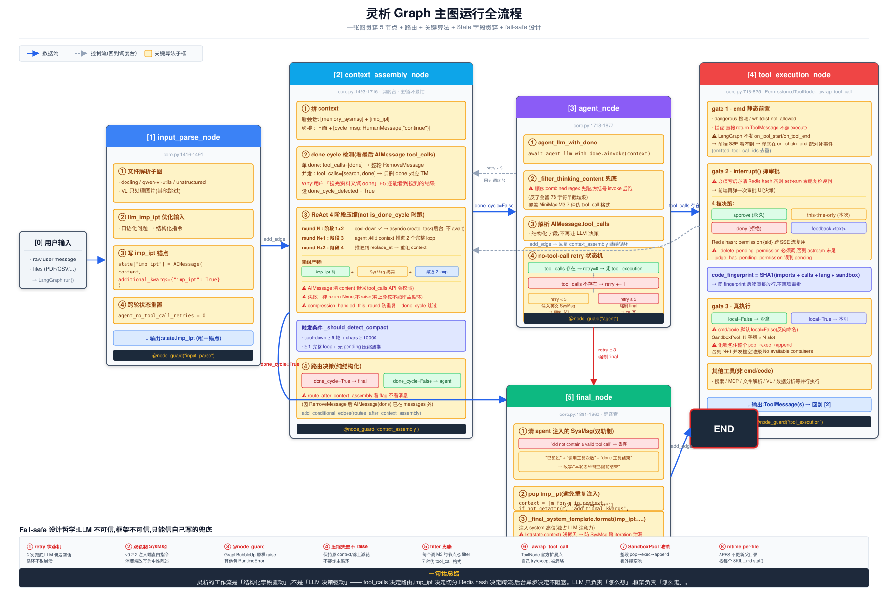

# Graph 核心算法

> 灵析后端的 LangGraph 主图运行全流程。**一张 SVG 图贯穿**,所有核心算法都嵌在图里。

---

## 一图看懂

> 打开 [`docs/img/graph-workflow.svg`](img/graph-workflow.svg) 可在浏览器/GitHub/VSCode 缩放查看矢量细节。

---

## 阅读路径

**顺着数据流从左到右走一遍**,5 节点一次串完:

1. **input_parse_node**(蓝) — 解析文件 + 优化输入 + 写 imp_ipt 锚点 + 重置 retry=0
2. **context_assembly_node**(青,主循环最忙) — 拼 context + done cycle 检测 + ReAct 4 阶段压缩 + 路由
3. **agent_node**(紫) — LLM 决策 + filter 兜底 + retry 状态机
4. **tool_execution_node**(红) — 4 道关卡:cmd 静态前置 / interrupt() 审批 / 真执行 + SandboxPool
5. **final_node**(绿) — 清 SysMsg(双轨制) + pop imp_ipt + 注入 system 高位 + 输出 SUMMARY

**边的颜色**:
- 蓝色实线 = 数据流(add_edge / add_conditional_edges 的默认走法)
- 灰色虚线 = 控制流(回到调度台)
- 红色 = 强制路径(retry≥3)

---

## 图里的 4 大支撑系统(简化)

主图节点运行时,需要 4 个支撑系统的协作。简化版如下(细节各自独立文件):

| 支撑系统 | 在图运行时的角色 | 关键能力 |
|---|---|---|
| **PermissionedToolNode** | `[4] tool_execution_node` 的实现者 | 4 道关卡 + Redis hash 跨 SSE 流复用 + code_fingerprint 永久批准 |
| **SandboxPool** | cmd/code 工具的执行者 | K 容器 × N slot 并发模型 + 池锁整段 pop→exec→append |
| **MemoryManager** | `[2] context_assembly` 自动注入来源 | per-thread Lock + tmp+fsync+os.replace 原子写 + ChatService 串行调度 |
| **CheckpointJanitor** | 图运行产物的清理者 | retarget_to 回溯 + prune_thread + 双路并集保护规则 |

---

## 图运行时的核心结论

> **灵析的工作流是「结构化字段驱动」,不是「LLM 决策驱动」**——`tool_calls` 字段决定路由,`imp_ipt` 锚点决定上下文切分,Redis hash 决定审批跨流复用,后台异步决定 ReAct 压缩不阻塞。
>
> **LLM 只负责「怎么想」,框架负责「怎么走」**。顺着 SVG 图从左到右走一遍,所有算法一次串完。

---

## 文件位置速查

| 内容 | 位置 |
|---|---|
| 主图 + 5 节点 + 路由函数 | `backend/ChatMe/ChatWorkflow/core.py:1385-2029` |
| ReAct 4 阶段压缩 helpers | `backend/ChatMe/ChatWorkflow/core.py:540-791` |
| agent_node retry 状态机 | `backend/ChatMe/ChatWorkflow/core.py:1816-1864` |
| done cycle 检测 + RemoveMessage | `backend/ChatMe/ChatWorkflow/core.py:1680-1714` |
| final_node SysMsg 双轨制 | `backend/ChatMe/ChatWorkflow/core.py:1894-1910` |
| PermissionedToolNode | `backend/ChatMe/ChatWorkflow/mcps/permissions/core.py:718-825` |
| SandboxPool 池锁 | `backend/ChatMe/ChatWorkflow/mcps/sandbox/pool.py:244-310` |
| MemoryManager | `backend/ChatMe/ChatWorkflow/Memory/core.py:62-540` |
| ChatStateCore2 | `backend/ChatMe/ChatWorkflow/config/models.py:24-63` |
| CheckpointJanitor | `backend/ChatMe/ChatWorkflow/CheckpointJanitor.py:99-563` |